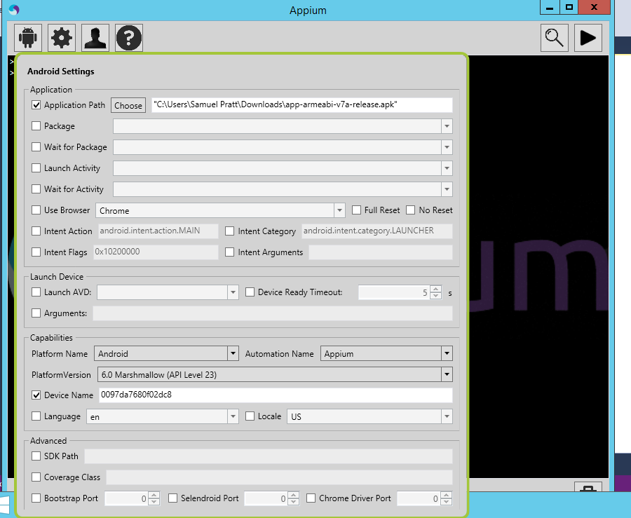

# AppiumPoc
## Overview
A quick and dirty POC for using Appium to automate testing of the Android version of an App

## You will need
* Visual Studio 2015 Update 3 or newer
* Appium http://appium.io/
* The Android SDK and Emulator configured to run API level 23 or newer on x86. The easiest way to get this is to install Android Studio
* The App APK
* The Java SDK

## Configuring Appium

You will need to configure: -
* The path to the APK
* The device Name (you get get this from ```adb devices -l```

It should look like the following



## Configuring Credentials

You will need to create a App.config.Credentials file in the AppiumTest folder this should look like the following: -

```xml
<?xml version="1.0" encoding="utf-8" ?>
<appSettings>
  <add key="Username" value="foo@example.org" />
  <add key="Password" value="your password" />
  <add key="deviceName" value="your android device name from adb devices -l" />
</appSettings>
```
